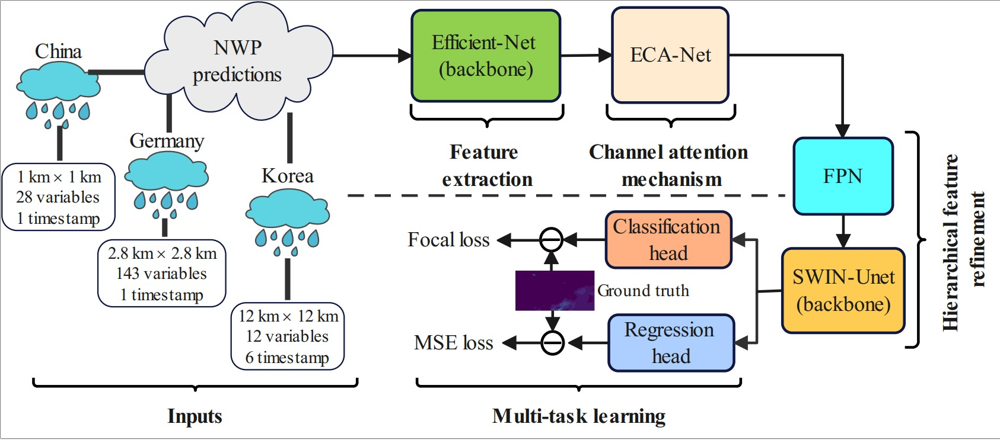

# Rain-PostEFnet

 

## Overview

Accurate precipitation forecasting is essential for
disaster preparedness, water resource management, and climate
modeling. Numerical Weather Prediction (NWP) models, while
extensively utilized, suffer from inherent limitations such as
systematic biases, coarse spatial resolution, and difficulty in ac-
curately predicting extreme rainfall events. Deep learning-based
post-processing has emerged as a promising approach to refine
NWP outputs; however, existing methods struggle with effectively
capturing multi-scale meteorological features and addressing
severe class imbalances in extreme precipitation predictions.
To overcome these challenges, we propose Rain-PostEFNet, a
deep learning framework designed for post-processing NWP
precipitation forecasts. The model integrates EfficientNet for
feature extraction, ECA-Net for adaptive channel attention, and
FPN-Swin-Unet for multi-scale feature refinement, along with a
multi-task learning strategy that jointly optimizes classification
and regression tasks using weighted focal loss and MSE loss. We
evaluate our approach on the PostRainBench datasets (China,
Germany, Korea) using Critical Success Index (CSI), Heidke
Skill Score (HSS), and Accuracy (ACC) as evaluation metrics.
Experimental results demonstrate that Rain-PostEFNet surpasses
state-of-the-art baselines, achieving CSI improvements of 63.94%
(China), 4.28% (Germany), and 2.1% (Korea) for moderate
rain classification, and 78.34% (China), 9.09% (Germany), and
7.68% (Korea) for heavy rain classification. Similarly, HSS scores
improve by 52.18% in China and 2.95% in Germany for rain,
and by 52.4% in China and 6.78% in Germany for heavy rain.
Additionally, an ablation study further confirms the impact of
the multi-task learning framework and attention mechanisms in
refining NWP predictions.

## Dataset

We summarize three NWP datasets with different spatial and temporal resolutions in the following 

## Dataset

Korea Dataset:

https://www.dropbox.com/sh/vbme8g8wtx9pitg/AAAB4o6_GhRq0wMc1JxdXFrVa?dl=0

Germany Dataset：

https://zenodo.org/records/7244319

China Dataset:

https://drive.google.com/file/d/1rBvxtQ8Gh9dXzh-okEOVpA8ZeDzr7yAI/view?usp=drive_link

d multi-task learning loss functions.

## Acknowledgement

We appreciate the following GitHub repo very much for the valuable code base and datasets:

https://github.com/osilab-kaist/KoMet-Benchmark-Dataset

https://github.com/DeepRainProject/models_for_radar

https://github.com/HuCaoFighting/Swin-Unet
